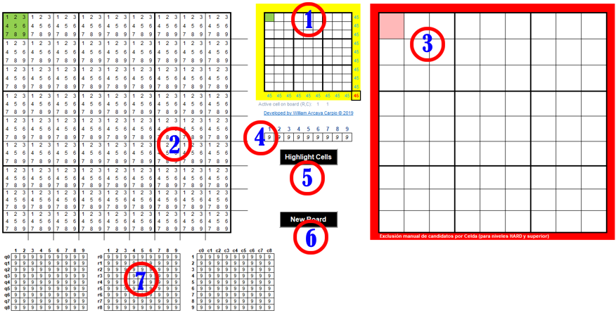
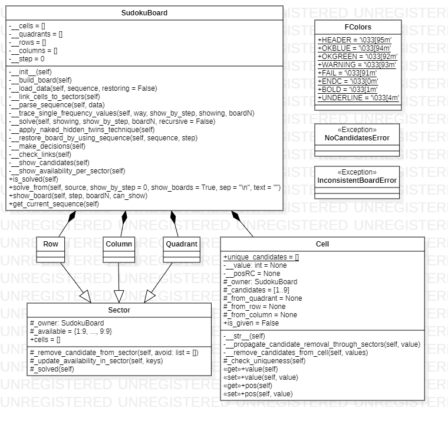

#  Helper & Solver for Sudoku

Un conjunto de utilitarios destinados a servir como herramientas de asistencia en la resolución de tableros Sudoku.

## Historia 📜

Este proyecto inició algunos años atrás (creo 2013), cuando en un momento de ocio, desvié mi atención a este juego, de reglas simples, pero que su resolución puede llevarte a un quebradero de cabeza. Fue entonces que, empleando una hoja de cálculo de MS-Excel, elaboré lo que sería la *primera versión de mi asistente*.

Pasaron algunos años (2015), para que en un momento nuevamente ocio, retomase este proyecto e hiciera algunas mejoras visuales a este asistente. En el presente (2019), retomando el proyecto, le agregué mejoras visuales y operativas. Esto también dio paso a desarrollar un aplicativo informático que resolviera tableros Sudoku, generándose la *primera versión de mi solucionador*.

## Asistente para Sudoku 🧙



#### Información

* Versión: **_3.2_**
* Formato del archivo: **_MS-Excel 2019 con macros habilitada_**
* Recurso a descargar: **_WizSudoku_v3.2.xlsm_**
* Versiones anteriores: [aquí](https://warcayac.wordpress.com/2013/06/23/asistente-para-resolver-el-sudoku/)

#### Descripción de componentes

1. **Tablero principal**: Propiamente el tablero Sudoku a resolver, es el lugar donde se estarán colocando los valores solución. Este tablero consta de 81 celdas (matriz de 9x9 celdas), 9 cuadrantes (3x3 celdas cada uno), 9 filas (9 celdas cada una), y 9 columnas (9 celdas cada una).

2. **Tablero de candidatos**: Es una vista ampliada del tablero principal, donde únicamente se visualizarán los candidatos disponibles (_1..9_) por cada celda. Este tablero visualizará apropiadamente los candidatos únicos (por celda), candidatos de frecuencia única (por sector), y los cambios en el tablero principal. De tal forma que nos indica visualmente el candidato solución para una celda específica. Su **actualización es automática**, no debe manipularse manualmente.

3. **Tablero de excepciones**: Si se desea que algún candidato quede exceptuado de una celda específica en el _Tablero de candidatos_, éste es el lugar para hacerlo. Por ejemplo, al aplicar la técnica de _"hidden/naked twins"_. Principalmente usado al resolver tableros de dificultad dificil o superior.

4. **Contador global de disponibilidad**: Cada candidato hábil en el tablero tiene un número determinado de apariciones, nueve (9). Esta sección es una ayuda visual para que tengamos presente cúanto de cada número hábil queda a disposición en el tablero, a medida que vayamos ingresando valores solución. Su **actualización es automática**.

5. **Botón de resaltado**: Usado para resaltar celdas llenadas del tablero principal. Útil en situaciones tales como: identificar los valores de entrada inicial al tablero, cuando se emplea el método de prueba-error y se desea marcar el estado presente desde dónde aplicar dicho método, y no tener que rehacer el tablero desde el inicio.

6. **Botón para nuevo tablero**: Útil cuando se desea iniciar un nuevo tablero, elimina tanto el contenido del _Tablero principal_ como el contenido del _Tablero de excepciones_.

7. **Tableros de disponibilidad**: Este conjunto de tres tableros, sirven para visualizar el estado de disponibilidad global de los candidatos por cuadrante, fila, y columna respectivamente. Puede llegar a ser útil para personas que están programando, caso contrario, es recomendable eliminarlos, ya que añaden ligero letargo en los movimientos del cursor a través de las celdas, por los cálculos que realizan.

#### Notas de uso

* El asistente conjuntamente con la técnica "hidden/naked twins", han mostrado bastante efectividad para resolver tableros de hasta grado dificil.

* Para tableros de grado dificil y superior, el asistente se vuelve poco efectivo si no se le complementa con otras técnicas de resolución (_X-wing_, etc.)

* Una celda siempre tendrá al menos un candidato, salvo que se le asigna un valor solución, en tal caso, los candidatos son eliminados para reflejar tal estado.

* Una celda sin valor asignado puede llegar a quedar sin candidatos, por las siguientes razones:
	1. Error de escritura del valor solución en alguna de las celdas anteriores, ó
	2. La ruta-solución en un método de prueba-error conduce a un tablero inconsistente o sin solución, por lo que debe descartarse el valor-solución candidato, y optar por otro.

* El orden de prioridad de atención para el llenado del _Tablero principal_ en función a lo mostrado en el _Tablero de candidatos_, es el siguiente:
	1. candidatos únicos por celda,
	2. candidatos únicos por cuadrante, y
	3. candidatos de frecuencia única en fila o columna.

* El símbolo ♠ indica que en la fila del Tablero de candidatos donde se posiciona, hay un candidato único por celda.

* El símbolo ◄ indica que en la fila donde se posiciona, hay un candidato de frecuencia única.

* El símbolo ▲ indica que en la columna donde se posiciona, hay un candidato de frecuencia única.

* Un candidato con **fondo rojo y letra blanca** señala un candidato único por celda.

* Un candidato con **fondo rosado y letra roja** señala un candidato único por cuadrante.
* Un candidato con **fondo amarillo y letra café** señala un candidato con frecuencia 2 en el cuadrante al que pertenece. Útil para la técnica _naked/hidden twins_.

* Video tutorial sobre el uso del asistente, [aquí](https://youtu.be/MuM-Imup_6M).

## Solucionador para Sudoku 🖥️

#### Información

* Versión: **_1.0_**
* Lenguaje: **_Python 3.8_**
* Enfoque empleado: **_Programación Orientada a Objetos_**
* Algoritmo implementado: **_Reglas del juego usando iteratividad y recursividad_**
* Técnicas de resolución para Sudoku usadas: **_Naked & Hidden Twins_**
* Tableros resolubles: **_Clásico (3x3)_**
* SO testeado: **_Ubuntu 18.04.3 LTS_** (usando WSL)

Se hace referencia al SO usado, ya que las presentaciones del tablero Sudoku, hacen uso de colores para resaltar la data inicial (las pistas) sobre la data solución; en terminales Linux no presenta inconveniente, pero sí en la consola de Windows, donde pueden aparecer los tableros distorsiones, ya que no reconoce los códigos de color.

#### Antecedente

Con las limitaciones que presentaba el _Asistente_ que desarrollé, me propuse elaborar un programa que resolviera (casi) cualquier clásico tablero Sudoku, y para ello me iba a servir de la lógica desarrollada e implementada en el _Asistente_; el cual fue fundamental, ya que me mostró el enfoque de programación a emplear, y la interacción entre los objetos. Cuando tuve una versión _beta_, fue de mi conocimiento la existencia de algoritmos desarrollados para su resolución, como se explica en los siguientes artículos:

* [A Sudoku Solver](https://www.cs.rochester.edu/u/brown/242/assts/termprojs/Sudoku09.pdf)
* [Sudoku as a constraint problem](https://www.inf.tu-dresden.de/content/institutes/ki/cl/study/winter06/fcp/fcp/sudoku.pdf)
* [Solving Every Sudoku Puzzle](https://norvig.com/sudoku.html)

Este último fue de mi interés, el de Peter Norvig, referenciado en varios sitios, y que además presentaba hechos estadísticos de la eficiencia de su programa, y del cual emulé algunas de sus funcionalidades para mi programa: _representación del tablero como una secuencia de caracteres, la de carga de datos y presentación del tablero_.

#### Descripción

Para la resolución de cualquier tablero Sudoku, se ha considerado la existencia e interacción de los siguientes objetos:

* Celdas (unidad básica de cualquier tablero, hay 81)
* Filas (agrupación horizontal de 9 celdas, hay 9)
* Columnas (agrupación vertical de 9 celdas, hay 9)
* Cuadrantes (agrupación matricial de 3x3 celdas, hay 9)
* Tablero (contenedor de todos los objetos antes mencionados)

#### Diagrama de clases


#### Algoritmo

1. Ingresar una secuencia fija de 81 caracteres alfanuméricos, o la localización del archivo de texto conteniendo secuencias fijas por línea

1. Conviertir cada secuencia en una representación del tablero a resolver

1. Verificar la existencia de celdas con candidato único, si existen, proceder a asignar a cada celda el candidato que le corresponde como valor solución para el tablero

1. Comunicar el cambio de cada celda a todos los sectores (cuadrantes, filas, columnas) que la involucran, con la finalidad que actualicen los candidatos habilitados

1. Inspeccionar cada sector del tablero en busca de candidatos de frecuencia única por sector, si existen, proceder a asignar a cada celda el candidato que le corresponde como valor solución para el tablero

1. Repetir el paso 4

1. Repetir los pasos 3 al 6 hasta que no haya más cambios en el tablero

1. Si no hay tablero solución, aplicar la técnica de _naked/hidden twins_. Seguir el paso 7. Esta técnica se aplicará una sola vez si tras ejecutar el paso 7, el tablero sigue sin cambios

1. Si no hay tablero solución, proceder a tomar decisiones basado en múltiples opciones acorde al menor número de candidatos por celda dentro del tablero. Dar como prioridad las decisiones binarias con celdas conteniendo candidatos de frecuencia 2 dentro del cuadrante al que pertenece

1. Ejecutar una decisión indica que se ha escogido una candidato de una celda escogida (ver paso anterior) y ver si ella conduce a una ruta solución para el tablero. Para ello, el método entrará a un modo recursivo de los pasos 3 al actual, hasta que se agoten todas las opciones

1. El proceso termina cuando se halle un tablero solución o la determinación de inconsistencia del mismo.

Dentro de la implementación del algoritmo, se tiene en cuenta que una opción no es viable cuando alguna celda del tablero se queda sin candidatos, sin que dicha celda se le haya asignado un valor solución.

Para correr el programa, se hace por tablero (una secuencia), 

```python
Puzzle.solve_from("_1______3______________46_7_9__________1_3____43___8_56__8___2___7_5_98___5_4_7__", 
	text="expert", show_boards=True, show_by_step=0)
```

o por un lote de tableros (un archivo de texto).

```python
Puzzle.solve_from("data/easy50.txt", text="easy", show_boards=False, sep="========")
```

Los argumentos que comprende le método **solve_from()** son:

	- source	: (str) cadena de texto representando: (1) una secuencia fija de 81 
			caracteres alfanuméricos, ó (2) la localización del archivo conteniendo 
			secuencias de tableros Sudoku.
	- show_by_step	: (int) cada cuántos pasos/asignaciones se mostrará el estado del
			tablero Sudoku siendo resuelto. Omitido si se un lote de tableros, en 
			tal caso sólo llega a mostrar el tablero final.
	- show_boards	: (bool) permite la visualización de tableros intermedios y final.
	- sep		: (str) separador entre secuencias, útil si 'source' es un archivo.
	- text		: (str) texto a agregar al sumario estadístico final.


#### Resultados

En esta sección se va a contrastar con los resultados proporcionados por [Peter Norvig](https://norvig.com/sudoku.html).

El programa es ejecutado empleando los mismos conjuntos de datos, es decir, [50 tableros fáciles](./data/easy50.txt), [95 tableros difíciles](./data/top95.txt), y [11 tableros muy difíciles](./data/hardest.txt). Adicionalmente, se ha agregado un archivo con [16 tableros más difíciles](./data/hardest(2019).txt) y más recientes.

```
$ python3.8 sudoku_solver.py
Excluded 0, Unsolved 0, Solved 50 of 50 easy puzzles (avg 0.00130 secs (771 Hz), max 0.00474 secs)
Excluded 0, Unsolved 0, Solved 95 of 95 hard puzzles (avg 0.02727 secs (37 Hz), max 0.14894 secs)
Excluded 0, Unsolved 0, Solved 11 of 11 hardest puzzles (avg 0.00870 secs (115 Hz), max 0.03140 secs)
Excluded 0, Unsolved 0, Solved 16 of 16 hardest (2019) puzzles (avg 0.01167 secs (86 Hz), max 0.12656 secs)
```

Los tres primeros resultados contrastados con los obtenidos por Perter Norvig, son indudablemente mejores.

Norvig plantea un tablero muy dificil (17 pistas), el cual cuando lo corro con mi programa resulta:

```
.....6....59.....82....8....45........3........6..3.54...325..6..................
****************************** [ BOARD Nº 1: STEP 41 ] ******************************
834|916|527
659|237|148
271|458|639
───┼───┼───
945|672|381
783|541|962
126|893|754
───┼───┼───
417|325|896
398|164|275
562|789|413

(0.01150 seconds)
```
La diferencia en tiempo es muy notoria: **_188.79_** segundos contra **_0.01_** segundos.

Y para el caso del tablero que no tiene solución:

```
.....5.8....6.1.43..........1.5........1.6...3.......553.....61........4.........
[ERROR] Tablero inconsistente. Celda {'row': 7, 'col': 4} se ha quedado sin valores candidatos
[InconsistentBoardError] Candidatos [2, 7, 8, 9] conducen a un tablero inconsistente.
(20.14582 seconds)
```

Igualmente los resultados guardan una diferencia abismal: **_1439_** segundos contra **_20.15_** segundos.

Aunque el valor de Norvig puede parecer irreal, esto lo he podido comprobar en otros sitios (que claman ser rápidos) donde aplican o el algoritmo de **_backtracking_** o el de **_constraint propagation_**, ejemplo:

* [SudokuSolver.net](https://sudokusolver.net)
* [Sudoku Solver](http://datagenetics.com/blog/january12019/index.html) de DataGenetics

## Conclusión 💭

* Mi algoritmo resulta ser más efectivo en la resolución de tableros que el de Peter Norvig, pero no tan eficiente, debido a que mientras el código de Norvig es 195 líneas, el mío es de 600 líneas aproximadamente.

* La poca efectividad del algortimo de Norvig se compensa con su campo de aplicación, el cual es diverso, mientras que el mío su campo de acción es muy restringido.

## Proyecto futuro 🔮

* Implementar un algoritmo de red neuronal.

## License 📄

Los recursos proporcionados son liberados bajo la [licencia MIT](./LICENSE).
